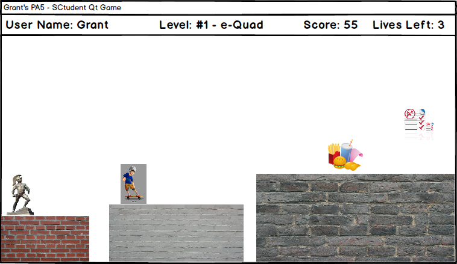
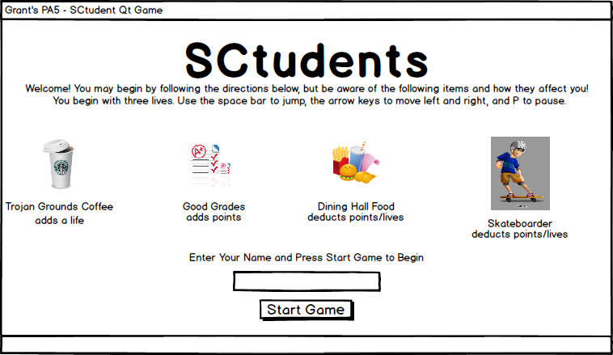

# Game Design Document
This is a place holder for your game design document. You are advised to write your document in [Markdown](http://daringfireball.net/projects/markdown/) and the following section will show you how to write a document using Markdown markup.

Alternativley, you can write your document in plain text if you wish.

----

## Movable Things
SCtudent is to have severavel different "things" relating to the daily life of a student at USC. Primarily, the game will have _bad_ things that take away from the score of the player, and _good_ things that add to the score of the player.

The following is a detailed description of the things a user can interact with throughout the course of their gameplay:

### Extra Credit Assignments (Good Thing)
Adds ten or fifteen bonus points the score of a user throughout gameplay if the user jumps up or navigates around an obstacle to reach the extra credit. The extra credit is denoted by a paper icon with a green plus (as shown below), but they get progressivly harder to obtain and find as gameplay goes on and gets more difficult.

Image Sourced From [IconArchive](http://www.iconarchive.com/show/shimmer-icons-by-creative-freedom/Document-Add-icon.html)

### Dining Hall Food (Bad Thing)
Dining hall food is very bad for your character. Avoid it like the plague! Dining hall food appears randomly in your way throughout gameplay and can move toward you from side to side, and if you can't avoid it, touching it will cause your character to lose ten to fifteen points due to sickness. If you also touch dining hall food more than four times in one level, your character will lose a life!

Image Sourced From [IconArchive](http://www.iconarchive.com/show/christmas-icons-by-mohsenfakharian/fast-food-icon.html)

### Gameplay Structures/Pathways (Good and Bad)
Playing the side-scrolling game involved moving to the right in the environment to have the player reach their final goal. As they move, they will have to stay on a specific pathway, represented by bricks, that changes in height (i.e. they player will have to jump up or down to continue moving to the right). Each path represents a stationary texture image that represents a specific part of campus for each level (the e-quad or Trousdale Parkway, for example).

The user gains a steady amount of points as they move to the right, gaining more and more points the faster gameplay goes (5 points for every completed structure going right on the beginning levels, then 8 for the second level, and so on). In areas where there is no brick pathway and users have to jump to advance to the right, failing to jump and falling through an empty spot in the bricks will cost the user a life.

Textures for each level look like the following brick patterns:

Image Sourced From [High Resultion Textures](http://www.highresolutiontextures.com/free-brick-wall-texture-pack)

### Skateboarders (Bad Thing)
Skateboarders are one of the most prevalent items in the game. They will appear at random intervals and skateboard towards your character, and you have to avoid them. If you collide with a skateboarder, you will love fifteen to twenty points, but colliding more than three times will cause your player to lose a life.

Image Sourced From [Will Samatis](http://officialwill.blogspot.com/2011/07/flash-game-art.html)

### Good Grade (Good Thing)
A good grade is one of the easiest ways to gain points. They appear randomly but bounce around the window, making them slightly difficult to obtain. However, catching one can lead to a bonus addition of twenve to sixteen points for the player.

Image Sourced From [AppGraphix](http://www.appgraphix.com/portfolios/iphone-icon-2/)

### Trojan Grounds Coffee (Good Thing)
A Starbucks coffee from Trojan Grounds appears rarely, but when it does and you can catch it, it can give your player another life, making it the most valuable item to obtain in all of the game.

Image Sourced From [IconFinder](http://www.iconfinder.com/icondetails/47674/128/coffee_cup_lid_starbucks_icon)

## Gameplay

This game is to be played via the keyboard. The user will first see a menu with brief game instructions, and after entering a name in a text box and clicking a start button, they user can begin to play.

After the user begins gameplay, the **left** and **right** arrow keys move the player's character left and right. The **spacebar** allows a character to jump, and the **P** letter key lets a user pause the game to access the menu.

## Scoring

The user begins with an initial score of **zero** and **four** total lives. As described above, the factors and items below control scoring in the game after it has started. A user can both gain and lose points as well as lives as gameplay progresses.

- **Good Grade** - Adds 12-16 points to the user's score.
- **Extra Credit Assignments** - Adds 10-15 points to the user's score.
- **Starbucks** - Adds a new life to the user.
- **Skateboarder** - Collisions deduct 15-20 points. 3+ collisions cause the user to lose a life.
- **Dining Hall Food** - Collisions deduct 10-15 points. 4+ collisions cause the user to lose a life.
- **Walls and Pathways** - Going forward past each path successfully gives the user 5 points on the beginning level, then 8, then 11, then so on. Falling through to the ground by failing to jump forward to another object deducts a life.

Gameplay ends (the user dies) when a user loses all lives or all points, whichever comes first.

## User Interface

The game will have a few distinct screens. Primarily, its main menu (shown below) will illustrate the users some of the basic icons and demonstrate to the user what each one does (i.e. tell them if it is a good or bad thing). This page also has a prompt for the user to type in their name and begin the game.

Second, the gameplay screen, roughly prototyped below, will show the user their name, score, level name, and lives left along a top bar. At the same time, most of this window will be taken up by game play, as shown.

