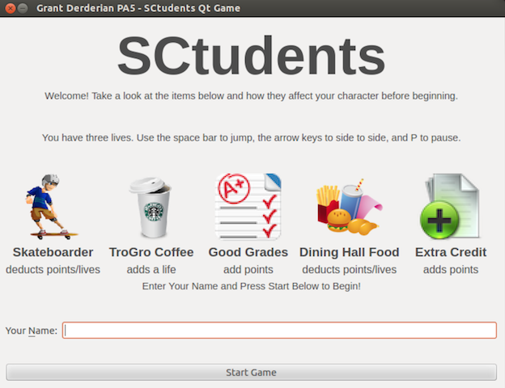

# SCtudents Game Design Document
SCtudents (pronounced students) is a side-scrolling game that pretends to model the life of a student at USC. Each level grows progressively harder as the user advances down a different part of the USC campus (Trousdale Parkway, e-Quad, McCarthy Quad, etc.) while trying to catch items that help them gain points (like extra credit and Trojan Grounds coffee) and avoid items that hurt them by deducting points and lives (like skateboarders or dining hall food).

The user will begin and, using the arrow keys, they will have to move up, down, left, and right to dodge bad obstacles that come at them (like skateboarders) and collect good objects which can give them lives and points (like coffee and good grades). The game will get progressively harder, meaning more and more items will be thrown at the user to catch. It is the ultimate goal of the user to stay alive for as long as possible while gaining as many points as possible at the same time.

Below is a listing of levels for the game:
- **Founders Park**
- **Alumni Park**
- **Parkside**
- **e-Quad**
- **McCarthy Quad**
- **Trousdale Parkway**

As time progresses through each level, it will get more and more difficult as more obstacles and fewer bonus items appear, with the final levels such as Trousdale Parkway being nearly impossible to complete due to many obstacles and difficult terrain.

----

## Movable Things
SCtudent is to have severavel different "things" relating to the daily life of a student at USC. Primarily, the game will have _bad_ things that take away from the score of the player, and _good_ things that add to the score of the player.

The following is a detailed description of the things a user can interact with throughout the course of their gameplay:

### Extra Credit Assignments (Good Thing)
Adds fifteen to twenty bonus points the score of a user throughout gameplay if the user navigates around an obstacle to reach the extra credit. The extra credit is denoted by a paper icon with a green plus (as shown below), but they get progressivly harder to obtain and find as gameplay goes on and gets more difficult.

Image Sourced From [IconArchive](http://www.iconarchive.com/show/shimmer-icons-by-creative-freedom/Document-Add-icon.html)

### Dining Hall Food (Bad Thing)
Dining hall food is very bad for your character. Avoid it like the plague! Dining hall food appears randomly in your way throughout gameplay and can move toward you from side to side, and if you can't avoid it, touching it will cause your character to lose four points due to sickness. If you also touch dining hall food more than four times, your character will lose a life!

Image Sourced From [IconArchive](http://www.iconarchive.com/show/christmas-icons-by-mohsenfakharian/fast-food-icon.html)

### Background Image
The user must stay within the bounds of the USC campus while playing. This means they cannot move outside this window.

The background looks like the following:

Image Sourced From [High Resultion Textures](http://www.highresolutiontextures.com/free-brick-wall-texture-pack)

### Skateboarders (Bad Thing)
Skateboarders are one of the most prevalent items in the game. They will appear at random intervals and skateboard towards your character, and you have to avoid them. If you collide with a skateboarder, you will love five points, but colliding more than three times will cause your player to lose a life.

Image Sourced From [Will Samatis](http://officialwill.blogspot.com/2011/07/flash-game-art.html)

### Good Grade (Good Thing)
A good grade is one of the easiest ways to gain points. They appear randomly but bounce around the window, making them slightly difficult to obtain. However, catching one can lead to a bonus addition of twelve to sixteen points for the player.

Image Sourced From [AppGraphix](http://www.appgraphix.com/portfolios/iphone-icon-2/)

### Trojan Grounds Coffee (Good Thing)
A Starbucks coffee from Trojan Grounds appears rarely, but when it does and you can catch it, it can give your player another life, making it the most valuable item to obtain in all of the game.

Image Sourced From [IconFinder](http://www.iconfinder.com/icondetails/47674/128/coffee_cup_lid_starbucks_icon)

## Gameplay

This game is to be played via the keyboard. The user will first see a menu with brief game instructions, and after entering a name in a text box and clicking a start button, they user can begin to play.

After the user begins gameplay, the **left** and **right** arrow keys move the player's character left and right. There are also **restart**, **pause**, and  **quit** buttons available for the user to press during gameplay.

## Scoring

The user begins with an initial score of **zero** and **four** total lives. As described above, the factors and items below control scoring in the game after it has started. A user can both gain and lose points as well as lives as gameplay progresses.

- **Good Grade** - Adds 12-16 points to the user's score.
- **Extra Credit Assignments** - Adds 15-20 points to the user's score.
- **Starbucks** - Adds a new life to the user.
- **Skateboarder** - Collisions deduct 5 points. 3+ collisions cause the user to lose a life.
- **Dining Hall Food** - Collisions deduct 5 points. 4+ collisions cause the user to lose a life.

Gameplay ends (the user dies) when a user loses all lives or all points, whichever comes first.

## User Interface

The game will have a few distinct screens. Primarily, its main menu (shown below) will illustrate the users some of the basic icons and demonstrate to the user what each one does (i.e. tell them if it is a good or bad thing). This page also has a prompt for the user to type in their name and begin the game.

Second, the gameplay screen, roughly prototyped below, will show the user their name, score, level name, and lives left along a top bar. At the same time, most of this window will be taken up by game play, as shown.

In the gameplay example shown above, "SCTudent", or the user's character, will have to grab good objects like grades while also dodging obstacles at the same time (such as the skateboarder going towards him). Towards the right, he will have to avoid the food in his way in order to avoid getting sick and will also have to jump to capture the good grades to get him bonus points, which will be moving up and down. As shown, this section of gamplay represents a fictional level #1 for the e-Quad.

Additional screens are also available, such as a screen very similar to the main menu (just without the start button and name box) that shows then a user presses **P** to pause the game.
