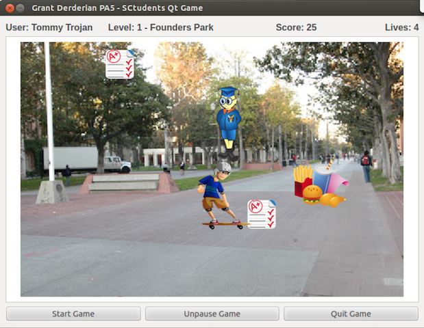

# SCtudents Game - CSCI102 Final Project
### Student Information
  + Name: Grant Derderian

### Game Information
  + Game Name: SCtudents
  + Game Description: SCtudents allows a player to model the fictional life of a student at USC by dodging obstacles and gaining lives and points as they progress through a part of campus to reach Tommy Trojan on each level.
  + [Game Design Doc](GameDesignDoc.md)

### Compile & Run Instructions
The grader should use the following procedure to compile and run the code:
```shell
#Compile Instructions
qmake -project
qmake
make
#Doxygen Instructions
doxygen -g config.txt
doxygen config.txt
#Command to run
./game_gderderi
```

### Screenshots


----

